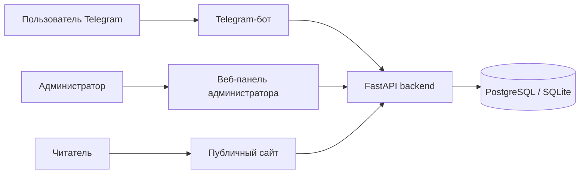
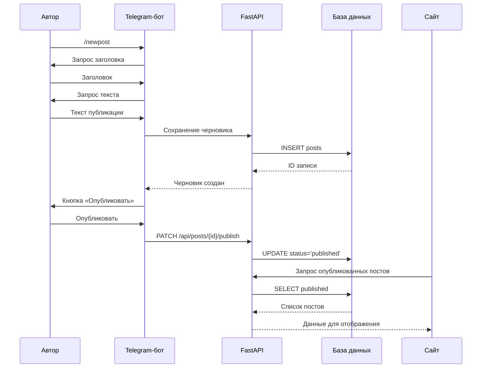

# Архитектура системы

## Назначение

Система предназначена для автоматизации создания и ведения блога через Telegram-бота и веб-интерфейс. Основная идея: автору не нужно вручную редактировать сайт, он создает запись в Telegram, после чего запись сохраняется в базе и может быть опубликована на веб-странице.

## Компоненты

1. **Telegram-бот**. Принимает команды пользователя, собирает заголовок и текст поста, сохраняет черновик, позволяет опубликовать запись.
2. **Backend API**. Обрабатывает REST-запросы, управляет публикациями, отвечает за валидацию данных и взаимодействие с базой данных.
3. **База данных**. Хранит публикации, статусы, данные автора и даты создания/публикации.
4. **Публичный сайт**. Отображает опубликованные записи.
5. **Админ-панель**. Позволяет администратору создавать, публиковать и удалять записи.

## Общая схема взаимодействия

## Поток создания публикации

## Основные сущности данных

| Поле | Тип | Назначение |
|---|---|---|
| id | integer | Уникальный идентификатор публикации |
| title | string | Заголовок |
| slug | string | Человекочитаемый адрес публикации |
| body | text | Основной текст |
| status | string | Статус: draft, published, archived |
| author_telegram_id | integer/null | Telegram ID автора |
| author_name | string/null | Имя автора |
| created_at | datetime | Дата создания |
| updated_at | datetime | Дата изменения |
| published_at | datetime/null | Дата публикации |
